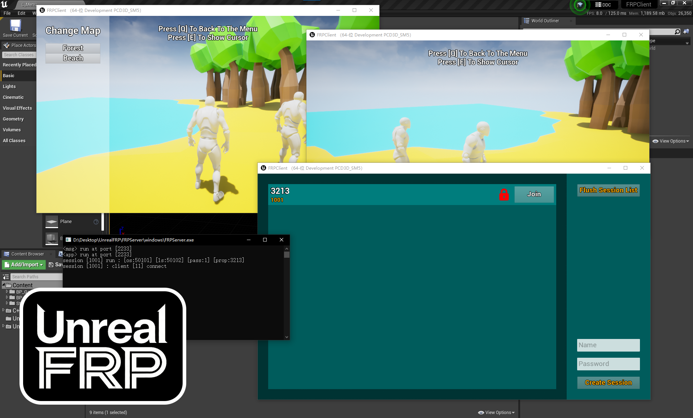

# UnrealFRP – UE4/5 Multiplayer Online Session System  
## Languages
- [简体中文](README.md)
---
## Introduction
UnrealFRP is an `Unreal Engine` online session system plugin based on `FRP (Fast Reverse Proxy)`. It includes a `plugin` + `server` + `demo client`, allowing you to quickly build a `WAN multiplayer room system` in `UE4/UE5`.

---
## Project Structure
- **FRPClient** (UE demo client)  
- **FRPServer** (server)  
- **UnrealFRP** (UE plugin)
---
## Features
- Create/close rooms  
- Connect to rooms  
- Room list  
- Room name / attributes / password  
---
## Development Environment
- Windows 10 x64 22H2  
- Unreal Engine 4.27.2  
- Visual Studio 2022  
---
## How to Use the Demo Client?
1. Open `FRPServer` using `VS2022` or any other CMake tool and compile it  
2. Run the compiled `FRPServer/windows/FRPServer.exe`  
3. Open the UE demo client  
4. Run it as a `Standalone Game`  
---
## How to Add It to Your Own Game?
1. Create a `Plugins` folder in your project directory  
2. Place the `UnrealFRP` plugin inside the folder  
3. Regenerate and compile your project  
## Support
- QQ：3201548104
- EMail1：3201548104@qq.com
- EMail2：lhy1339@gmail.com